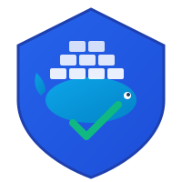

<div align="center">



# DockWarden

**Modern Docker Container Manager - Auto-Update & Health Monitor**

[](https://github.com/emon5122/dockwarden/releases)
[](https://hub.docker.com/r/emon5122/dockwarden)
[](LICENSE)
[](go.mod)

*A spiritual successor to Watchtower and Docker Watchdog, actively maintained with modern security practices.*

[Quick Start](#quick-start) •
[Web UI](#web-dashboard) •
[Documentation](#documentation) •
[Docker Hub](https://hub.docker.com/r/emon5122/dockwarden) •
[Contributing](#contributing)

</div>

---

## ✨ Features

### 🔄 Automatic Updates
- **Image Updates**: Automatically detect and pull new Docker images
- **Smart Detection**: Digest-based comparison for accurate update detection
- **Concurrent Processing**: Leverages Go's native goroutines for parallel container updates
- **Rolling Updates**: Update containers gracefully with configurable strategies
- **Scheduled Updates**: Cron-style scheduling with timezone support
- **Auto Cleanup**: Remove old images after update (enabled by default)

### 🏥 Health Monitoring
- **Health Checks**: Monitor container health status continuously
- **Auto-Restart**: Automatically restart unhealthy containers (up to 5 attempts)
- **Smart Recovery**: Stops retry attempts after 5 failures until new image version arrives
- **Dependency Awareness**: Restart containers in the correct order

### 🌐 Web Dashboard
- **Real-time UI**: Beautiful dark-mode dashboard built with Gin, HTMX, and Tailwind CSS
- **Live Updates**: Stats and container status refresh automatically every 5 seconds
- **Container Management**: Restart containers directly from the web interface
- **Prometheus Metrics**: Built-in metrics endpoint for monitoring

### 🔐 Security First
- **Docker Secrets**: Native support for Docker secrets (no config.json mounting!)
- **Minimal Permissions**: Optional socket proxy support for least-privilege access
- **Read-Only Mode**: Run with read-only root filesystem
- **Modern API**: Uses latest Docker Engine API

### 📢 Notifications
- Discord webhooks (with rich embeds)
- Slack webhooks
- Telegram bots
- Gotify, Ntfy
- Generic JSON webhooks

### 📊 Observability
- Prometheus metrics endpoint (`/metrics`)
- Structured JSON logging
- REST API for integration
- Health check endpoint

---

## 🚀 Quick Start

### Basic Usage

```bash
docker run -d \
  --name dockwarden \
  --restart unless-stopped \
  -v /var/run/docker.sock:/var/run/docker.sock \
  emon5122/dockwarden
```

That's it! DockWarden will:
- Check for updates every **1 minute**
- Pull latest images and recreate containers
- Clean up old images automatically
- Monitor container health and restart unhealthy ones (up to 5 times)
- Use **Asia/Dhaka** timezone by default

### With Web Dashboard

```bash
docker run -d \
  --name dockwarden \
  --restart unless-stopped \
  -v /var/run/docker.sock:/var/run/docker.sock \
  -p 8080:8080 \
  -e DOCKWARDEN_API_ENABLED=true \
  emon5122/dockwarden
```

Access the dashboard at `http://localhost:8080`

### With Docker Compose

```yaml
services:
  dockwarden:
    image: emon5122/dockwarden:latest
    container_name: dockwarden
    restart: unless-stopped
    ports:
      - "8080:8080"
    volumes:
      - /var/run/docker.sock:/var/run/docker.sock
    environment:
      - DOCKWARDEN_API_ENABLED=true
      - DOCKWARDEN_NOTIFICATION_URL=https://discord.com/api/webhooks/...
      - TZ=Asia/Dhaka
```

### With Docker Secrets (Recommended)

```yaml
services:
  dockwarden:
    image: emon5122/dockwarden:latest
    container_name: dockwarden
    restart: unless-stopped
    volumes:
      - /var/run/docker.sock:/var/run/docker.sock
    secrets:
      - registry_auth
    environment:
      - DOCKWARDEN_REGISTRY_SECRET=/run/secrets/registry_auth

secrets:
  registry_auth:
    file: ./secrets/registry-auth.json
```

---

## 🖥️ Web Dashboard

DockWarden includes a beautiful, real-time web dashboard built with modern technologies:

- **Gin** - High-performance Go web framework
- **HTMX** - Dynamic updates without writing JavaScript
- **Tailwind CSS** - Modern, responsive styling

### Features:
- 📊 Live container statistics
- 🔄 One-click update trigger
- 🔃 Restart containers from UI
- 📱 Responsive design for mobile
- 🌙 Dark mode by default

Enable with `--api-enabled` flag or `DOCKWARDEN_API_ENABLED=true` environment variable.

---

## 📖 Documentation

| Topic | Description |
|-------|-------------|
| [Configuration](docs/configuration.md) | Environment variables and options |
| [Container Labels](docs/labels.md) | Per-container configuration |
| [Private Registries](docs/registries.md) | Authentication setup |
| [Security Guide](docs/security.md) | Best practices and socket proxy |
| [Notifications](docs/notifications.md) | Setting up alerts |
| [API Reference](docs/api.md) | REST API documentation |
| [Metrics](docs/metrics.md) | Prometheus integration |
| [Migration Guide](docs/migration.md) | Moving from Watchtower/Watchdog |

---

## ⚙️ Configuration

### Default Behavior

DockWarden comes with sensible defaults:

| Setting | Default | Description |
|---------|---------|-------------|
| Interval | `1 minute` | Time between update checks |
| Cleanup | `true` | Automatically remove old images |
| Health Watch | `true` | Monitor and restart unhealthy containers |
| Max Restart Attempts | `5` | Give up after 5 restart failures |
| Timezone | `Asia/Dhaka` | Default timezone |

### Environment Variables

| Variable | Default | Description |
|----------|---------|-------------|
| `DOCKWARDEN_INTERVAL` | `1m` | Check interval (e.g., `1m`, `5m`, `1h`) |
| `DOCKWARDEN_SCHEDULE` | - | Cron expression (e.g., `0 0 4 * * *`) |
| `DOCKWARDEN_CLEANUP` | `true` | Remove old images after update |
| `DOCKWARDEN_LABEL_ENABLE` | `false` | Only manage labeled containers |
| `DOCKWARDEN_HEALTH_WATCH` | `true` | Enable health monitoring |
| `DOCKWARDEN_HEALTH_ACTION` | `restart` | Action on unhealthy: `restart` or `notify` |
| `DOCKWARDEN_API_ENABLED` | `false` | Enable web UI and REST API |
| `DOCKWARDEN_API_PORT` | `8080` | Web UI and API port |
| `DOCKWARDEN_METRICS` | `false` | Enable Prometheus metrics |
| `DOCKWARDEN_NOTIFICATION_URL` | - | Discord/Slack/Telegram webhook URL |
| `DOCKWARDEN_LOG_LEVEL` | `info` | Log level (debug/info/warn/error) |
| `TZ` | `Asia/Dhaka` | Timezone |

### Container Labels

```yaml
labels:
  - "dockwarden.enable=true"
  - "dockwarden.update.enable=true"
  - "dockwarden.watch.enable=true"
  - "dockwarden.stop-signal=SIGTERM"
  - "dockwarden.stop-timeout=30"
  - "dockwarden.scope=production"
```

See [full configuration documentation](docs/configuration.md) for all options.

---

## 📢 Notifications

DockWarden supports multiple notification providers:

### Discord

```bash
DOCKWARDEN_NOTIFICATION_URL=https://discord.com/api/webhooks/xxx/yyy
```

Sends rich embeds with container info, update status, and health alerts.

### Slack

```bash
DOCKWARDEN_NOTIFICATION_URL=https://hooks.slack.com/services/xxx/yyy/zzz
```

### Telegram

```bash
DOCKWARDEN_NOTIFICATION_URL=telegram://BOT_TOKEN@telegram?chats=CHAT_ID
```

### Generic Webhook

Any URL will receive a JSON payload:

```json
{
  "source": "dockwarden",
  "type": "container_updated",
  "message": "Container nginx has been updated",
  "container_name": "nginx",
  "image": "nginx:latest",
  "timestamp": "2026-01-31T14:30:00Z"
}
```

---

## 🔐 Security Best Practices

### Using Docker Socket Proxy

For enhanced security, use a socket proxy to limit DockWarden's access:

```yaml
services:
  dockwarden:
    image: emon5122/dockwarden:latest
    environment:
      - DOCKER_HOST=tcp://socket-proxy:2375
    depends_on:
      - socket-proxy

  socket-proxy:
    image: tecnativa/docker-socket-proxy
    privileged: true
    environment:
      - CONTAINERS=1
      - IMAGES=1
      - POST=1
    volumes:
      - /var/run/docker.sock:/var/run/docker.sock:ro
```

### Using Docker Secrets Instead of config.json

❌ **Old way (Watchtower):**
```yaml
volumes:
  - /root/.docker/config.json:/config.json  # Exposes credentials!
```

✅ **New way (DockWarden):**
```yaml
secrets:
  - registry_auth
environment:
  - DOCKWARDEN_REGISTRY_SECRET=/run/secrets/registry_auth
```

---

## 📊 Prometheus Metrics

Enable metrics with `DOCKWARDEN_METRICS=true`:

Available metrics:
- `dockwarden_containers_total` - Total number of containers
- `dockwarden_containers_running` - Running containers
- `dockwarden_containers_unhealthy` - Unhealthy containers
- `dockwarden_updates_total` - Total updates performed
- `dockwarden_update_failures_total` - Failed updates
- `dockwarden_restarts_total` - Health-triggered restarts
- `dockwarden_check_duration_seconds` - Check duration

---

## 🔄 Migrating from Watchtower

DockWarden is designed as a drop-in replacement:

```yaml
# Replace this:
image: containrrr/watchtower

# With this:
image: emon5122/dockwarden:latest
```

Key differences:
- Default interval is 1 minute (not 5 minutes)
- Cleanup is enabled by default
- Health monitoring is built-in
- Web UI available with `--api-enabled`
- Default timezone is Asia/Dhaka

Environment variable mapping:
```
WATCHTOWER_CLEANUP      → DOCKWARDEN_CLEANUP
WATCHTOWER_SCHEDULE     → DOCKWARDEN_SCHEDULE
WATCHTOWER_POLL_INTERVAL → DOCKWARDEN_INTERVAL
WATCHTOWER_LABEL_ENABLE → DOCKWARDEN_LABEL_ENABLE
```

See the [Migration Guide](docs/migration.md) for detailed instructions.

---

## 🏗️ Building from Source

```bash
# Clone the repository
git clone https://github.com/emon5122/dockwarden.git
cd dockwarden

# Build
go build -o dockwarden ./cmd/dockwarden

# Build Docker image
docker build -t emon5122/dockwarden:local -f build/Dockerfile .
```

---

## 🤝 Contributing

Contributions are welcome! Please see our [Contributing Guide](CONTRIBUTING.md) for details.

1. Fork the repository
2. Create a feature branch (`git checkout -b feature/amazing-feature`)
3. Commit your changes (`git commit -m 'Add amazing feature'`)
4. Push to the branch (`git push origin feature/amazing-feature`)
5. Open a Pull Request

---

## 📜 License

This project is licensed under the MIT License - see the [LICENSE](LICENSE) file for details.

---

## 🙏 Acknowledgments

DockWarden builds upon the excellent work of:
- [Watchtower](https://github.com/containrrr/watchtower) - The original container update automation tool
- [Docker Watchdog](https://github.com/buanet/docker.watchdog) - Simple health monitoring

Special thanks to all contributors of these projects!

---

<div align="center">

**[⬆ Back to Top](#dockwarden)**

Made with ❤️ for the Docker community

[](https://buymeacoffee.com/emon5122)

</div>
